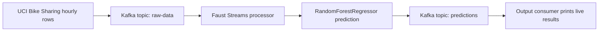

# Kafka Bike Sharing ML Streaming

This is my Assignment 1 project for the real-time streaming application. The project uses Apache Kafka to stream rows from the UCI Bike Sharing dataset, runs a trained machine learning model in a Faust stream processor, and prints the prediction results from an output topic.

Repository: https://github.com/Lumysia/kafka-bike-sharing-ml-streaming

## Demo Video

The demo video is embedded below using a GitHub attachment link.

<video src="https://github.com/user-attachments/assets/c082308f-9117-45a9-933f-76507feeac52" controls width="100%"></video>

If the video preview does not load in GitHub, open the attachment directly:

```text
https://github.com/user-attachments/assets/c082308f-9117-45a9-933f-76507feeac52
```

The demo shows three terminals running at the same time:

1. Faust Streams processor
2. Output consumer
3. Kafka producer sending one row per second

## Pipeline



## Dataset

Dataset: UCI Bike Sharing Dataset

Source: https://archive.ics.uci.edu/dataset/275/bike+sharing+dataset

I used the hourly dataset, `hour.csv`. Each row represents one hour of bike rental data. The target value is `cnt`, which is the total number of bike rentals for that hour.

The main features used by the model are:

```text
season, yr, mnth, hr, holiday, weekday, workingday, weathersit, temp, atemp, hum, windspeed
```

The training script can download the dataset automatically, but I also included `data/hour.csv` so the project can run directly.

## Streams API Used

I used Python with Faust, which is the Python streaming library option from the assignment.

The stream processor is in:

```text
src/stream_processor.py
```

It uses a Faust agent:

```python
@app.agent(raw_topic)
async def predict_rentals(events):
```

So the processing step is not just a plain Kafka consumer loop. The Faust worker consumes from `raw-data`, applies the trained model, and sends a new message to `predictions`.

## Machine Learning Model

Model: `RandomForestRegressor`

Training script:

```text
src/train_model.py
```

Saved model file:

```text
models/bike_sharing_model.joblib
```

This is a regression problem because the model predicts a number of rentals, not a class label. Because of that, I report regression metrics instead of accuracy/F1.

Model results from the test split:

```text
Dataset rows: 17379
Train rows: 13903
Test rows: 3476
MAE: 25.053
MSE: 1778.578
RMSE: 42.173
R2: 0.9438
```

These results are also saved in:

```text
models/metrics.txt
```

## Setup

This project uses `uv` for Python dependencies.

Install dependencies:

```bash
uv sync
```

Start local Kafka with Docker:

```bash
docker compose up -d
```

Train or retrain the model:

```bash
uv run python -m src.train_model
```

Create the Kafka topics:

```bash
uv run python -m src.topics
```

The two topics are:

```text
raw-data
predictions
```

## How To Run

Open three terminals in the project folder.

Terminal 1, start the Faust Streams processor:

```bash
uv run faust -A src.stream_processor worker -l info
```

Wait until it says the worker is ready.

Terminal 2, start the output consumer:

```bash
CONSUMER_GROUP=demo-run-1 uv run python -m src.output_consumer
```

Terminal 3, start the producer:

```bash
STREAM_LIMIT=60 uv run python -m src.producer
```

The producer sends one row per second. The `STREAM_LIMIT=60` option is used so the demo runs for about one minute instead of streaming the whole dataset.

For a quick local test, I used:

```bash
STREAM_LIMIT=10 STREAM_DELAY=0.1 uv run python -m src.producer
```

If the output consumer does not show old messages, use a new consumer group name:

```bash
CONSUMER_GROUP=demo-run-2 uv run python -m src.output_consumer
```

## Example Output

The output consumer prints results like this:

```text
instant | hour | predicted | actual | abs_error
----------------------------------------------------
      1 |    0 |        27 |     16 |        11
      2 |    1 |        32 |     40 |         8
      3 |    2 |        24 |     32 |         8
```

The Faust processor also logs each processed event:

```text
processed row=1 predicted=27 actual=16 error=11
processed row=2 predicted=32 actual=40 error=8
```

## Project Files

```text
src/train_model.py       Downloads data, trains the model, and saves metrics
src/producer.py          Sends Bike Sharing rows to the raw-data topic
src/stream_processor.py  Faust Streams processor from raw-data to predictions
src/output_consumer.py   Reads predictions and prints them live
src/topics.py            Creates the Kafka topics
models/                  Saved trained model and metrics
data/hour.csv            Bike Sharing hourly dataset
pyproject.toml           uv dependency configuration
uv.lock                  Locked dependency versions
docker-compose.yml       Local Kafka broker setup
```
